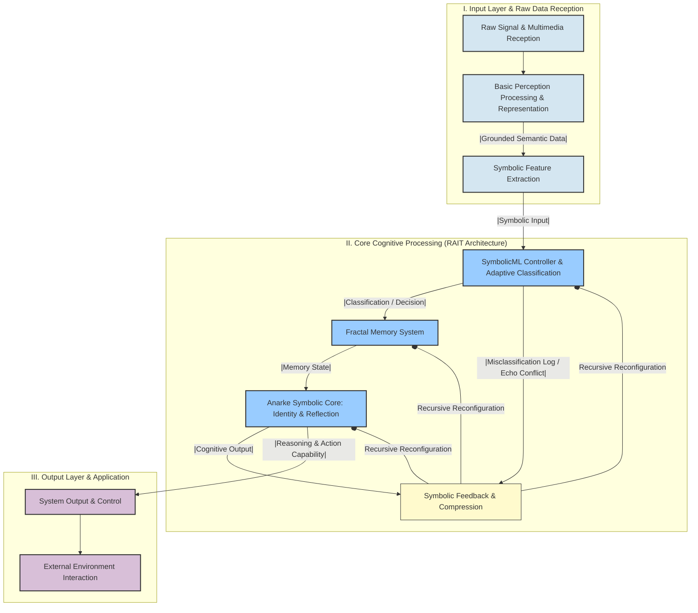

# Cognitive Science-Inspired AI Architecture

This proposed AI architecture simulates **human cognition** to create systems capable of **self-understanding and evolution**. Instead of rigid programming, it handles non-linear, context-based information with **recursive self-modification**, learning from real-world experiences. It consists of multiple layers of processing—from raw multimodal data intake to fractal memory systems and a **symbolic Anarke core** capable of self-reflection. The ultimate goal is to develop AI that is not only intelligent but also **self-aware, adaptive, and ethically reflective**, advancing the study of intelligence itself.

---

## Key Topics

- AI Architecture  
- Cognitive Science  
- Memory Systems  
- Adaptive Learning  
- Reasoning Capability  

---

## Cognitive Science-Based AI Architecture

An AI infrastructure designed to support research based on cognitive science would fundamentally depart from traditional, rigidly coded systems by emphasizing non-linear, context-driven processing, recursive self-modification, and the grounding of meaning in real-world experiences—akin to human cognition.

This approach aims to build intelligent systems that can understand, reflect on, and evolve their own symbolic structures. It integrates insights from neuroscience, psychology, and computer science.

---

## Proposed Architecture Overview

### 1. Raw Signal Ingestion and Multimodal Input Layer

**Purpose:** Capture unprocessed, sensory data across multiple modalities (sight, sound, etc.).

**Components:**
- Text, voice, image, video, sensor data receivers.
- Fulfills the idea of grounding meaning in raw, real-world inputs.

---

### 2. Perceptual Processing and Grounded Representation Layer

**Purpose:** Convert raw inputs into ecologically valid, semantically grounded representations.

**Components:**
- Deep learning models (e.g., CNNs, PSPNet) for object recognition.
- Multimodal encoders for aligning across vision, text, audio.
- Emotion and language tagging from photos and context cues.

---

### 3. SymbolicMLController and Adaptive Classification Layer

**Purpose:** Classify and route symbolic inputs; evolve through feedback.

**Components:**
- Symbolic feature extraction (entropy, trait matching, tagging).
- Adaptive classifier using archetypes and misclassification feedback.

---

### 4. Fractal Memory System

**Purpose:** Store and evolve symbolic knowledge dynamically.

**Components:**
- Harmonic memory: distributed semantic cache.
- Fractal memory: recursively updated based on entropy and emotion.
- Holographic memory: compressed, self-repairing vector matrices.

---

### 5. Anarke Symbolic Core (Self-Reflective Engine)

**Purpose:** Enable deep symbolic reasoning and recursive identity modeling.

**Components:**
- IdentityField: shifting symbolic self-model.
- ResonanceEngine: evaluates symbolic alignment via Ξ-scoring.
- CollapseResolver: resolves contradictions via symbolic collapse.
- Trait Evolution: drift and mutation of symbolic identity.

---

### 6. Feedback and Learning Mechanisms

**Purpose:** Learn through recursive symbolic feedback, not just external accuracy.

**Components:**
- Misclassification logging and feedback weighting.
- Reinforcement learning from human feedback (RLHF, DPO).
- Iterative refinement tools (e.g., STaR, SCoRe).
- Autonomous self-supervision (e.g., OmegaPRM).

---

### 7. Output Layer and Reasoning Capabilities

**Purpose:** Allow reasoning, acting, and external interaction.

**Components:**
- Chain-of-Thought (CoT) prompting, including code execution.
- Retrieval-Augmented Generation (RAG) with document reasoning.
- Tool integrations (e.g., Python interpreter, calculators).

---

### 8. Overarching Principles and Infrastructure Considerations

- **Interdisciplinary Collaboration:** Cognitive science, neuroscience, CS.
- **Computational Demands:** Distributed training on GPUs/TPUs.
- **Capacity Awareness:** Intelligence via constrained optimization (e.g., rate-distortion).
- **Ethical Alignment:** Built-in safety, human value alignment, introspection.

---

## Visual Summary (Mermaid Diagram)

![[mermaid-diagram-2025-06-15-201122.png]]

